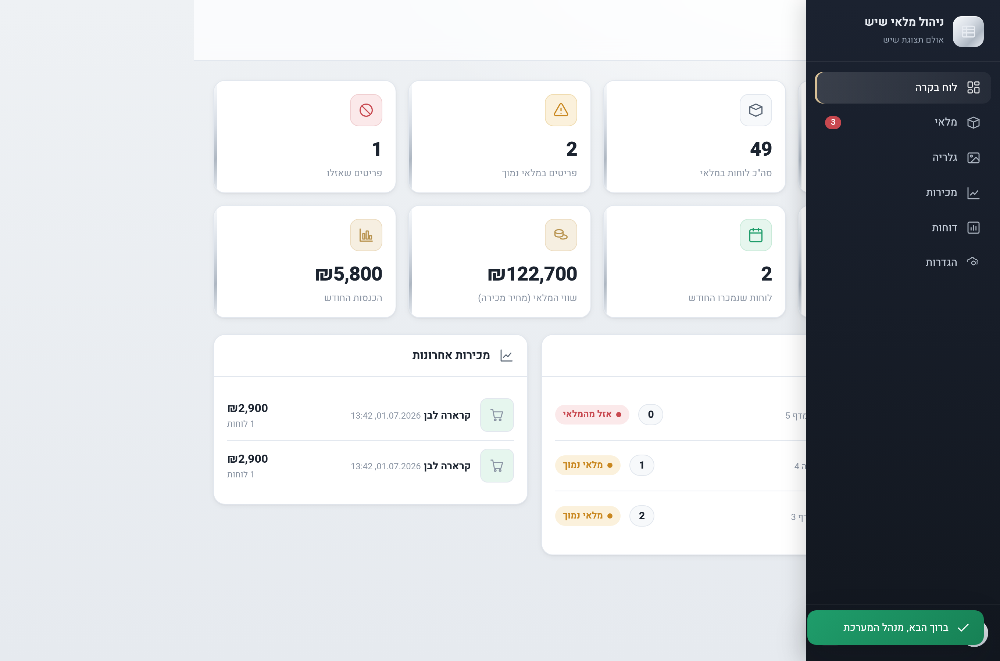

# ניהול מלאי שיש · Marble Inventory Management

מערכת ניהול מלאי מקצועית לאולם תצוגת שיש ואבן טבעית — עברית מלאה, ממשק RTL, עיצוב יוקרתי, בסיס נתונים אמיתי, התחברות מאובטחת, ותמיכה מלאה במובייל.

A professional, production‑ready inventory management web app for a marble / stone‑slab showroom. Full Hebrew RTL interface, real database, secure login, image uploads, dashboard, sales history, gallery and reports.



---

## תכונות עיקריות

- **התחברות מאובטחת** — JWT + סיסמאות מוצפנות (bcrypt), עוגיות `httpOnly`.
- **הרשאות משתמשים** — `מנהל` (הוספה/עריכה/מחיקה/מכירה) ו‑`צופה` (צפייה בלבד).
- **לוח בקרה** — סך סוגי שיש, סך לוחות במלאי, מלאי נמוך, אזל, נמכר היום/החודש, שווי מלאי והכנסות.
- **ניהול מלאי** — טבלה וכרטיסים, כולל שם עברי/אנגלי, קטגוריה, צבע, עובי, מידות, כמות, מיקום, תמונה, מחיר עלות/מכירה והערות.
- **פעולות מלאי** — הוספת מלאי, הפחתת מלאי, עדכון כמות ידני, ו**מכירת לוח בלחיצה אחת** (הכמות יורדת אוטומטית ולא יורדת מתחת לאפס).
- **סטטוס אוטומטי** — `במלאי` / `מלאי נמוך` (מתחת לסף) / `אזל מהמלאי` (0).
- **היסטוריית מכירות** — כל מכירה נשמרת עם תאריך, שעה, כמות, מחיר, לקוח, טלפון והערות.
- **חיפוש וסינון** — לפי שם, צבע, עובי, מיקום, קטגוריה וסטטוס מלאי.
- **גלריה** — תצוגת יוקרה של סוגי השיש עם תמונות, מחיר וכפתור מכירה מהיר.
- **דוחות** — השיש הנמכר ביותר, מכירות חודשיות, שווי מלאי, רשימת מלאי נמוך ופילוח לפי קטגוריה.
- **העלאת תמונות** — העלאה ישירה מהמחשב או מהטלפון.
- **מותאם למובייל** — עובד מצוין בטלפון ובמחשב.

## טכנולוגיות

| שכבה | טכנולוגיה |
|------|-----------|
| שרת | Node.js + Express |
| בסיס נתונים | SQLite (`better-sqlite3`) — אמיתי ומתמיד, לא `localStorage` |
| אבטחה | JWT, bcrypt |
| העלאת קבצים | Multer |
| צד לקוח | Vanilla JS (ES Modules) + CSS — ללא שלב build, ממשק RTL יוקרתי |

---

## הפעלה מקומית

דרושה גרסת Node ‏18 ומעלה.

```bash
npm install
cp .env.example .env      # ערוך את הסיסמה והסוד לפי הצורך
npm start
```

פתח את הכתובת: `http://localhost:3000`

**משתמשי ברירת מחדל (נוצרים אוטומטית בהפעלה ראשונה):**

- מנהל: `admin` / `admin123`
- צופה: `viewer` / `viewer123`

> חשוב: שנה את הסיסמה ואת `JWT_SECRET` בקובץ `.env` לפני העלייה לאוויר.

### משתני סביבה

| משתנה | ברירת מחדל | תיאור |
|-------|------------|-------|
| `PORT` | `3000` | פורט השרת |
| `JWT_SECRET` | — | מפתח חתימה לטוקנים (חובה לשנות בפרודקשן) |
| `ADMIN_USERNAME` / `ADMIN_PASSWORD` | `admin` / `admin123` | חשבון המנהל הראשוני |
| `LOW_STOCK_THRESHOLD` | `3` | סף למלאי נמוך |
| `BUSINESS_NAME` | `אולם תצוגת שיש` | שם העסק |
| `DB_PATH` | `data/marble.db` | מיקום קובץ בסיס הנתונים |
| `UPLOAD_DIR` | `uploads/` | תיקיית התמונות שהועלו |
| `SEED_DEMO` | `true` | האם לטעון נתוני דוגמה בהפעלה ראשונה (`false` לביטול) |

---

## פרסום (Live link)

האפליקציה מוכנה לפרסום. שלוש דרכים נפוצות:

### Render (מומלץ — כולל דיסק מתמיד)

הריפו כולל `render.yaml`. ב‑[Render](https://render.com): **New → Blueprint**, בחר את הריפו, הגדר `ADMIN_PASSWORD`, ולחץ Deploy. תקבל כתובת חיה ציבורית (`https://…onrender.com`) שנפתחת מהטלפון ומהמחשב. הדיסק המתמיד שומר את בסיס הנתונים והתמונות בין פריסות.

### Docker

```bash
docker build -t marble-inventory .
docker run -p 3000:3000 \
  -e JWT_SECRET="your-long-random-secret" \
  -e ADMIN_PASSWORD="your-strong-password" \
  -v "$(pwd)/data:/app/data" \
  -v "$(pwd)/uploads:/app/uploads" \
  marble-inventory
```

### Railway / Fly.io / כל מארח Node

הרץ `npm install` ואז `node server/index.js` (יש `Procfile` מוכן). הגדר דיסק/נפח מתמיד לתיקיות `data` ו‑`uploads`.

---

## מבנה הפרויקט

```
server/
  index.js          שרת Express + הגשת קבצים סטטיים
  db.js             חיבור SQLite + סכימה
  auth.js           JWT + bcrypt + middleware הרשאות
  seed.js           אתחול: משתמש מנהל, הגדרות, נתוני דוגמה
  helpers.js        חישוב סטטוס מלאי
  routes/           auth, marbles, sales, dashboard, users, settings, upload
public/
  index.html        מעטפת SPA
  styles.css        עיצוב יוקרתי RTL
  js/               app (router), api, ui, icons, components/, pages/
```

## אבטחה

- סיסמאות נשמרות מוצפנות (bcrypt), לעולם לא כטקסט גלוי.
- כל פעולות הכתיבה (הוספה/עריכה/מחיקה/מכירה/מלאי) דורשות הרשאת מנהל.
- טוקן JWT בעוגיית `httpOnly`; יש להגדיר `JWT_SECRET` חזק בפרודקשן.
- העלאת קבצים מוגבלת לסוגי תמונה ולגודל של עד 8MB.
